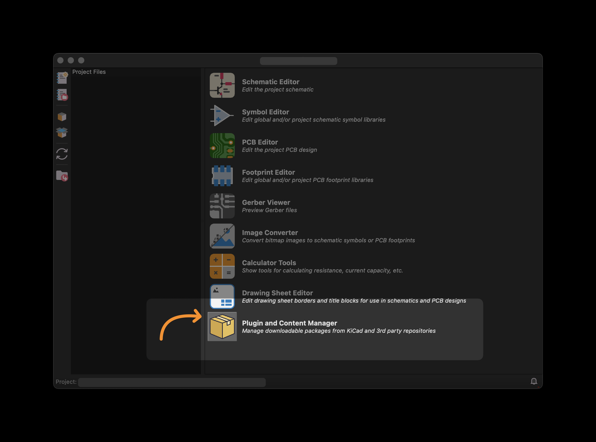
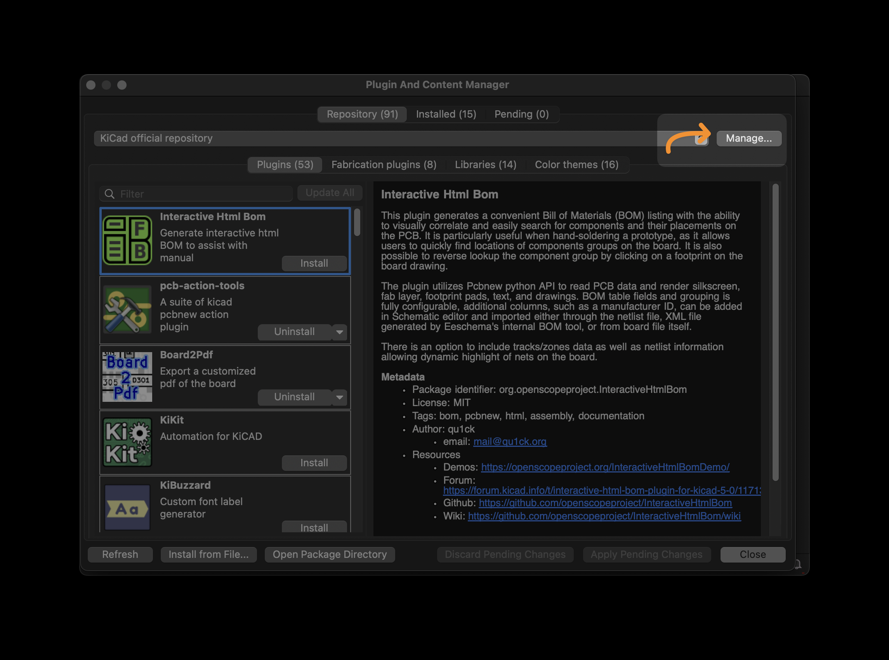
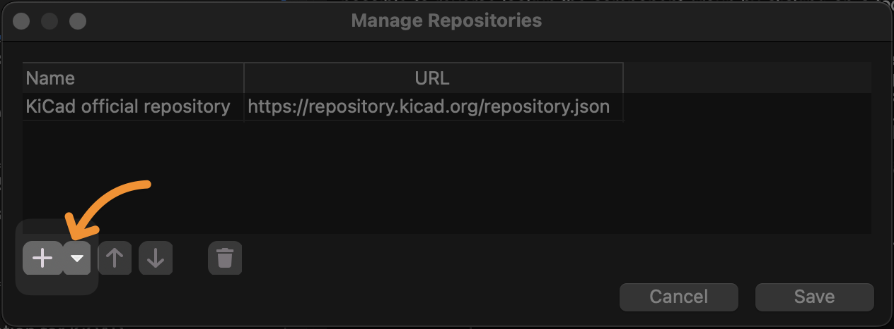
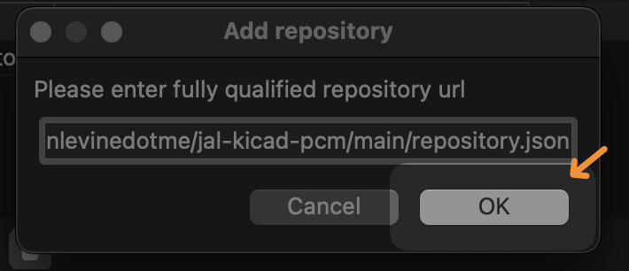

# JAL KiCad PCM Repository

[](https://github.com/justinlevinedotme/jal-kicad-pcm/actions/workflows/build-pcm.yml)


Custom **KiCad PCM index** maintained by **Justin Levine**  
[@justinlevinedotme](https://github.com/justinlevinedotme) · [justinlevine.me](https://www.justinlevine.me)

---

## 🚀 Add this index to KiCad

You can install packages from this repository by adding it as a custom source in KiCad’s **Plugin and Content Manager (PCM)**.

1. **Open the Plugin and Content Manager**  
   From the KiCad main window, click the 📦 **Plugin and Content Manager**.  
   

2. **Click “Manage…”**  
   In the PCM window, click the **Manage…** button in the upper-right.  
   

3. **Add a new repository**  
   In the “Manage Repositories” dialog, click the ➕ button to add a new source.  
   

4. **Enter the repository URL**  
   Paste the following URL and press **OK**:

```text
https://raw.githubusercontent.com/justinlevinedotme/jal-kicad-pcm/main/repository.json
```



5. **Save**  
   Click **Save** in the repositories list. You’ll now see the packages from this index in the PCM!

---

⚠️ **Note:** Always review and respect the license terms of each package before use. Licenses are displayed in the index table below in this README.

## 📦 Sources

<!-- AUTO-INDEX:START -->

> ⚖️ **Licensing Note:** This index aggregates third-party KiCad packages. Please review and respect each project’s license before use or redistribution. If a license isn’t specified here, check the upstream repository.While this repository itself is MIT-licensed, the packages included retain their original licenses.

| 📦 Package | 👤 Maintainer | 🧾 License |
|---|---|---|
| [KiCAD JLCPCB tools](https://github.com/bouni/kicad-jlcpcb-tools) | Bouni | WTFPL |
| [marbastlib](https://github.com/ebastler/marbastlib) | ebastler and MarvFPV | CERN-OHL |

_Last updated: **2026-02-26 08:14 UTC** • Packages: **2**_
<!-- AUTO-INDEX:END -->
